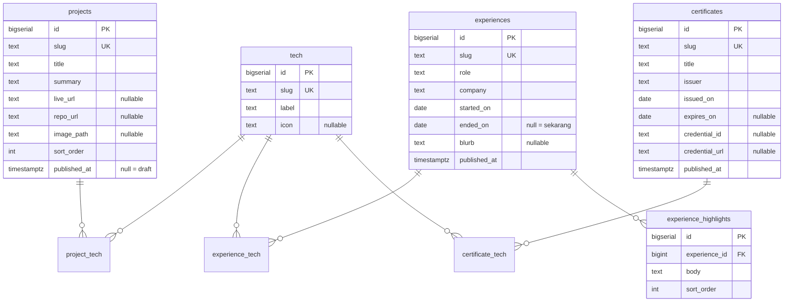

# Struktur Database — Portofolio

Dokumen ini mendefinisikan skema database untuk konten dinamis portofolio, plus
cara frontend Astro membacanya.

- **Frontend (repo ini)** — read-only. Hanya `SELECT`, hanya saat build.
- **Admin panel** — sistem terpisah, jalan di laptop, tidak pernah di-deploy.
  Pemilik satu-satunya operasi tulis, dan pemilik migration.
- **Database** — Postgres, hosted (catatan MySQL/SQLite di bagian akhir).
- **Gambar** — Cloudflare R2, di-upload admin panel. Database hanya menyimpan
  URL absolutnya.

## Keputusan arsitektur

Tidak ada API di antara frontend dan database. Astro build jalan di server dan
merupakan satu-satunya pembaca, jadi ia query database langsung — sebuah HTTP
API untuk melayani satu query per deploy adalah lapisan tanpa manfaat.

```
Admin Panel (laptop)  ──INSERT/UPDATE──►  Database (hosted)
                                                ▲
                                                │ SELECT, saat build saja
                                          Astro build (CI)
                                                │
                                                ▼
                                          HTML statis ──► Pages

Browser visitor  ──────────────────────►  R2 CDN  (gambar, satu-satunya
                                                   dependensi runtime)
```

Alasannya:

| Aspek | Konsekuensi |
| --- | --- |
| SEO | Crawler dapat konten penuh di HTML pertama, tanpa eksekusi JS |
| Performa | Tidak ada query saat visitor datang; LCP sekelas file statis |
| Ketahanan | Database mati tidak menjatuhkan situs — HTML terakhir tetap tayang |
| Biaya | Tidak ada server yang harus hidup untuk frontend |
| Permukaan serang | Admin tidak terekspos internet sama sekali |

Trade-off yang diterima: update konten butuh rebuild.

**Kredensial:** `DATABASE_URL` menunjuk ke role **read-only** (lihat
`.env.example`). Jadi batasan "frontend hanya baca" ditegakkan database, bukan
kesepakatan. Bocor pun, yang bisa dilakukan hanya `SELECT` — setara dengan
endpoint GET publik.

**Guard:** kredensial dideklarasikan lewat `astro:env`, jadi build gagal dengan
pesan yang menyebut variabelnya kalau tidak diset. Query juga `select *` +
validasi Zod, sehingga kolom yang hilang atau berganti nama gagal saat build
dengan nama field-nya — bukan tampil sebagai halaman kosong di produksi.

Kalau nanti ada halaman yang benar-benar harus instan, tandai **hanya halaman
itu** dengan `export const prerender = false`; sisanya tetap statis.

### Kapan API terpisah baru layak dibangun

- Ada konsumen kedua (aplikasi mobile, situs lain)
- Database dipindah ke belakang firewall dan hanya satu server boleh connect
- Kamu memang mau latihan membangun REST API

## Diagram relasi



## Skema

```sql
-- ---------------------------------------------------------------------------
-- lookup: satu baris per teknologi, dipakai bersama ketiga entitas
-- ---------------------------------------------------------------------------
create table tech (
  id         bigserial primary key,
  slug       text not null unique,          -- 'astro', 'ruby-on-rails'
  label      text not null,                 -- 'Astro', 'Ruby on Rails'
  icon       text,                          -- 'tabler:brand-astro'; null = chip teks saja
  created_at timestamptz not null default now(),
  updated_at timestamptz not null default now()
);

-- ---------------------------------------------------------------------------
-- projects  →  halaman /
-- ---------------------------------------------------------------------------
create table projects (
  id           bigserial primary key,
  slug         text not null unique,
  title        text not null,
  summary      text not null,               -- paragraf deskripsi
  live_url     text,
  repo_url     text,                        -- null = tombol "Source" tidak dirender
  image_path   text,                        -- URL object storage (R2)
  image_alt    text,
  image_width  int,                         -- selalu berpasangan dengan height
  image_height int,
  sort_order   int  not null default 0,     -- urutan manual, kecil di atas
  published_at timestamptz,                 -- null = draft, masa depan = terjadwal
  created_at   timestamptz not null default now(),
  updated_at   timestamptz not null default now()
);

-- ---------------------------------------------------------------------------
-- experiences  →  halaman /resume
-- ---------------------------------------------------------------------------
create table experiences (
  id           bigserial primary key,
  slug         text not null unique,
  role         text not null,               -- 'Fullstack Web Developer'
  company      text not null,
  company_url  text,
  started_on   date not null,
  ended_on     date,                        -- null = sampai sekarang
  blurb        text,                        -- kotak miring: apa itu perusahaannya
  published_at timestamptz,
  created_at   timestamptz not null default now(),
  updated_at   timestamptz not null default now()
);

create table experience_highlights (
  id            bigserial primary key,
  experience_id bigint not null references experiences(id) on delete cascade,
  body          text   not null,            -- satu poin pencapaian
  sort_order    int    not null default 0
);

-- ---------------------------------------------------------------------------
-- certificates  →  halaman /certificates
-- ---------------------------------------------------------------------------
create table certificates (
  id             bigserial primary key,
  slug           text not null unique,
  title          text not null,
  issuer         text not null,
  issuer_url     text,
  issued_on      date not null,
  expires_on     date,                      -- null = tidak kedaluwarsa
  credential_id  text,
  credential_url text,                      -- null = link "Verify" disembunyikan
  note           text,                      -- kotak miring: isi/cakupan sertifikat
  image_path     text,                      -- scan sertifikat
  image_alt      text,
  image_width    int,
  image_height   int,
  published_at   timestamptz,
  created_at     timestamptz not null default now(),
  updated_at     timestamptz not null default now()
);

-- ---------------------------------------------------------------------------
-- join: satu tabel per entitas (FK asli, bukan satu tabel polymorphic)
-- ---------------------------------------------------------------------------
create table project_tech (
  project_id bigint not null references projects(id) on delete cascade,
  tech_id    bigint not null references tech(id)     on delete restrict,
  sort_order int    not null default 0,
  primary key (project_id, tech_id)
);

create table experience_tech (
  experience_id bigint not null references experiences(id) on delete cascade,
  tech_id       bigint not null references tech(id)        on delete restrict,
  sort_order    int    not null default 0,
  primary key (experience_id, tech_id)
);

create table certificate_tech (
  certificate_id bigint not null references certificates(id) on delete cascade,
  tech_id        bigint not null references tech(id)         on delete restrict,
  sort_order     int    not null default 0,
  primary key (certificate_id, tech_id)
);

-- ---------------------------------------------------------------------------
-- index
-- ---------------------------------------------------------------------------
create index on projects     (published_at, sort_order);
create index on experiences  (published_at, started_on desc);
create index on certificates (published_at, issued_on desc);
create index on experience_highlights (experience_id, sort_order);
create index on project_tech     (tech_id);
create index on experience_tech  (tech_id);
create index on certificate_tech (tech_id);
```

## Pemetaan kolom ke UI

Referensi saat membangun form di admin panel — kolom mana muncul di mana.

### `projects` → [src/pages/index.astro](../../src/pages/index.astro)

| Kolom | Tampil sebagai |
| --- | --- |
| `title` | Judul `<h3>`, sekaligus link ke `live_url` |
| `live_url` | Target judul + chip "Live" dengan ikon `tabler:world` |
| `repo_url` | Chip "Source" dengan ikon `tabler:brand-github`; hilang kalau null |
| `summary` | Paragraf di bawah screenshot |
| `image_path` | Screenshot di dalam `.shot` (border hairline + hover lift) |
| `image_width`, `image_height` | Atribut `width`/`height` pada `` — mencegah layout shift |
| join `tech` | Baris chip mono uppercase di bawah judul |

### `experiences` → [src/pages/resume.astro](../../src/pages/resume.astro)

| Kolom | Tampil sebagai |
| --- | --- |
| `role` | Judul `<h3>` |
| `company`, `company_url` | Nama perusahaan, jadi link kalau `company_url` ada |
| `started_on`, `ended_on` | Rentang tahun; `ended_on` null dirender "Present" |
| `blurb` | Kotak miring di bawah daftar poin |
| `experience_highlights.body` | Daftar berpoin dengan ikon `tabler:circle-check` |
| join `tech` | Kolom chip di sisi kanan entri |

### `certificates` → [src/pages/certificates.astro](../../src/pages/certificates.astro)

| Kolom | Tampil sebagai |
| --- | --- |
| `title` | Judul `<h3>` |
| `issuer`, `issuer_url` | Nama penerbit, jadi link kalau ada URL |
| `issued_on` | Tahun/tanggal terbit di samping penerbit |
| `credential_id` | Baris "Credential ID" bergaya mono, ikon `tabler:id` |
| `credential_url` | Baris "Verify this credential"; hilang kalau null |
| `note` | Kotak miring: cakupan sertifikat |
| `image_path` | Scan di dalam `.shot`, `max-w-md`, klik untuk ukuran penuh |
| `image_width`, `image_height` | Atribut ``, sekaligus penentu orientasi |
| join `tech` | Kolom chip di sisi kanan entri |

## Keputusan desain

### `sort_order` hanya di `projects`

`experiences` diurutkan `started_on desc`, `certificates` diurutkan
`issued_on desc` — itu urutan alaminya, kolom manual jadi beban yang harus
dijaga konsisten. Tambahkan nanti kalau memang perlu menyematkan satu sertifikat
ke atas.

### Tidak ada kolom `orientation` di `certificates`

Orientasi bisa dihitung dari `image_width > image_height`. Kolom terpisah
menciptakan dua sumber kebenaran yang bisa saling bertentangan.

### `published_at` nullable, bukan enum `status`

Satu kolom mengurus tiga keadaan:

- `null` → draft, tidak pernah dikirim ke frontend
- masa lalu → tayang
- masa depan → terjadwal

### Filter draft di API, bukan di frontend

Setiap endpoint `GET` wajib menyaring:

```sql
where published_at is not null
  and published_at <= now()
```

Kalau filternya dikerjakan di Astro, isi draft tetap terkirim melewati jaringan
dan bisa terbaca siapa pun yang membuka response API.

### `experience_highlights` tabel terpisah, bukan `jsonb`

`jsonb` array string memang menghemat satu tabel. Tapi admin panel butuh UI
repeater yang bisa menambah, mengedit, dan mengurutkan tiap baris — bentuk
relasional lebih mudah dibangun dan divalidasi di sisi server. Kalau ternyata
form-nya cukup satu textarea per baris, `jsonb` juga sah.

### Tiga tabel join, bukan satu tabel polymorphic

Satu tabel `taggable(tech_id, entity_type, entity_id)` lebih sedikit DDL-nya,
tapi kehilangan foreign key asli — database tidak lagi bisa menolak baris yang
menunjuk entitas yang sudah dihapus. Untuk tiga entitas, tiga tabel join dengan
FK sungguhan adalah pilihan yang benar dan membosankan.

### `on delete restrict` pada `tech_id`

Menghapus teknologi yang masih dipakai harus ditolak, bukan menghilangkan chip
dari entri secara diam-diam. Admin panel menampilkan errornya.

## Cara frontend membacanya

Tidak ada endpoint. Implementasinya ada di dua file:

| File | Isi |
| --- | --- |
| `src/lib/schema.ts` | Bentuk row + validasi Zod + formatter tanggal. Tanpa import database, jadi bisa diuji sendiri. |
| `src/lib/portfolio.ts` | Koneksi Postgres + tiga query. Hanya dipanggil dari frontmatter halaman. |
| `src/lib/schema.test.ts` | Cek jalan: `bun src/lib/schema.test.ts` |

Tiga query, satu per halaman. `tech[]` dan `highlights[]` di-agregasi di SQL
supaya tidak ada N+1:

```sql
-- projects → halaman /
select p.*,
       coalesce((
         select json_agg(json_build_object('slug', t.slug, 'label', t.label, 'icon', t.icon)
                         order by pt.sort_order)
         from project_tech pt
         join tech t on t.id = pt.tech_id
         where pt.project_id = p.id
       ), '[]'::json) as tech
from projects p
where p.published_at is not null and p.published_at <= now()
order by p.sort_order, p.id;
```

`experiences` menambahkan satu subquery lagi untuk `experience_highlights`
(`json_agg(h.body order by h.sort_order)`), dan diurutkan `started_on desc`.
`certificates` diurutkan `issued_on desc`.

**`select *`, bukan daftar kolom.** Sengaja: admin panel yang memiliki
migration, jadi kolom yang berganti nama atau hilang harus muncul sebagai error
Zod yang menyebut nama field-nya, bukan sebagai `undefined` yang ter-render jadi
teks kosong di halaman. Tabelnya kecil dan query-nya sekali per deploy, jadi
tidak ada biaya nyata.

Nama ikon Tabler datang dari kolom `tech.icon` dan diteruskan ke komponen
`<Icon>`. Konsekuensinya: **salah ketik nama ikon di admin panel menggagalkan
build**, bukan menampilkan kotak kosong. Itu perilaku yang diinginkan, tapi
perlu diketahui.

## Penanganan gambar

Sudah jalan: admin panel mengompres ke webp di browser, meng-upload ke
**Cloudflare R2**, dan menyimpan URL absolutnya di `image_path`. Contoh nyata:

```
https://cdn.fkriachmd.qzz.io/projects/contoh-proyek-Z93TcxiR.webp
https://cdn.fkriachmd.qzz.io/certificates/example-certificate-4GP4oiFj.webp
```

Artinya browser visitor mengambil gambar **langsung dari R2**, tidak lewat
database atau build. Ini satu-satunya dependensi runtime yang dimiliki situs.
Domainnya sudah didaftarkan di `image.domains` pada `astro.config.mjs` supaya
`astro:assets` bisa dipakai kalau nanti dibutuhkan.

**Belum beres — `image_width` dan `image_height`.** Kolomnya tidak ada di
response admin panel saat ini, jadi `` ter-render tanpa atribut dimensi dan
halaman mengalami layout shift saat gambar selesai dimuat. Admin panel sebaiknya
membaca dimensi dari file saat upload (jangan minta user mengisi manual) dan
menyimpannya. Sisi frontend sudah siap: kalau kolomnya ada, dimensinya langsung
dipakai.

## Catatan MySQL / SQLite

| Postgres | MySQL | SQLite |
| --- | --- | --- |
| `bigserial primary key` | `bigint auto_increment primary key` | `integer primary key autoincrement` |
| `timestamptz` | `datetime` | `text` (ISO-8601) |
| `json_agg` / `json_build_object` | `json_arrayagg` / `json_object` | `json_group_array` / `json_object` |
| `now()` | `current_timestamp` | `current_timestamp` |

Sisanya identik. `updated_at` di Postgres perlu trigger; MySQL bisa
`on update current_timestamp`.

## Yang belum dimodelkan

Sengaja ditinggalkan — tambahkan kalau memang dibutuhkan, bukan sekarang:

- **Profil & link sosial** (nama, quote sidebar, email, GitHub/X/LinkedIn) masih
  hardcode di [src/components/Sidebar.astro](../../src/components/Sidebar.astro)
  dan [src/components/Nav.astro](../../src/components/Nav.astro). Satu baris data
  yang berubah sekali setahun tidak butuh tabel.
- **Kategori/tag project**, kalau nanti daftar project perlu difilter.
- **Terjemahan**, kalau situsnya jadi dua bahasa. Bentuknya nanti tabel
  `*_translations` per entitas, jangan kolom `title_en`/`title_id`.
- **Audit log**, kalau ternyata perlu tahu siapa mengubah apa. Untuk satu
  pengguna, `updated_at` sudah cukup.
